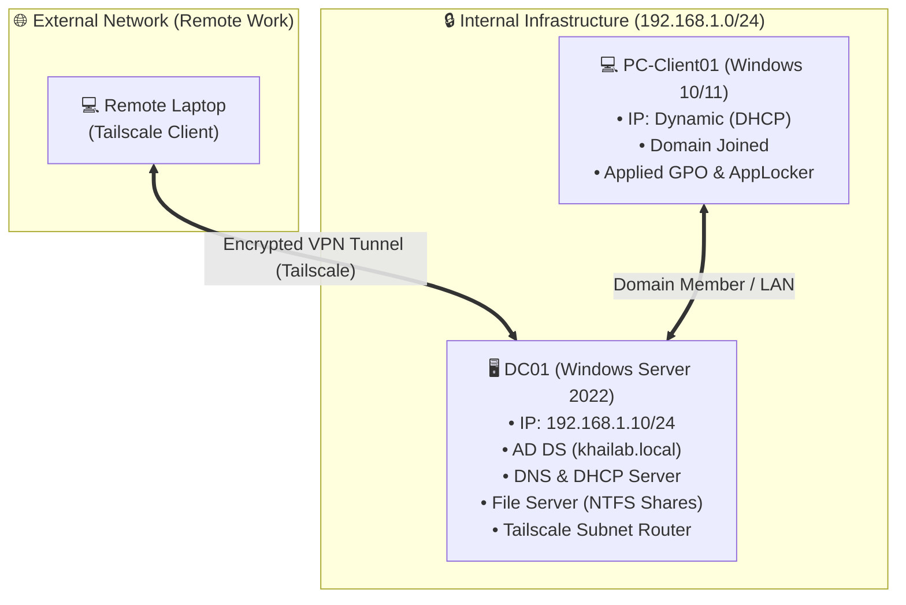

# 🖥️ Windows Server & Active Directory Enterprise Infrastructure Lab

[](https://www.microsoft.com/evalcenter/evaluate-windows-server-2022)
[](https://www.vmware.com/)
[
[](https://tailscale.com/)
[](https://github.com/)

---

## 📌 1. Giới thiệu dự án (Project Overview)

Dự án **Windows Server & Active Directory Enterprise Infrastructure Lab** mô phỏng mô hình hạ tầng mạng và quản trị hệ thống hoàn chỉnh cho một doanh nghiệp quy mô vừa và nhỏ trên nền tảng **Windows Server 2022**. 

Dự án tập trung giải quyết các bài toán lõi trong quản trị hệ thống CNTT (System Administration & IT Infrastructure):
- **Định danh & Quản lý truy cập (IAM)**: Dựng Domain Controller, quy hoạch cấu trúc OU, quản lý vòng đời User/Group.
- **Tăng cường bảo mật (System Hardening)**: Thiết lập Group Policy Objects (GPO), chặn CMD, khóa USB storage, kiểm soát thi hành phần mềm qua AppLocker.
- **Dịch vụ mạng lõi (Core Network Services)**: Cấu hình DNS phân giải hai chiều, cấp phát IP tự động qua DHCP Server, hạ tầng lưu trữ File Server phân quyền NTFS granular.
- **Truy cập từ xa an toàn (Secure Remote Access)**: Triển khai giải pháp Zero-Trust VPN (Tailscale Subnet Router) truy cập tài nguyên nội bộ không cần mở port trực tiếp.

> 📄 **Tài liệu tham chiếu**: Hệ thống được xây dựng bài bản theo tài liệu hướng dẫn quy chuẩn triển khai lab cá nhân 2026.

---

## 🎯 2. Tóm tắt kỹ năng nổi bật (CV Highlights)

Dưới đây là các năng lực cốt lõi được chứng minh qua dự án (tương ứng với mô tả trên CV):

- **Triển khai Active Directory Domain Services (AD DS)**: Khởi tạo Forest/Domain `khailab.local`, quy hoạch cấu trúc Organizational Unit (OU) theo phòng ban, quản lý Security Groups và tự động hóa tạo người dùng bằng PowerShell script.
- **Thực thi chính sách an toàn thông tin qua GPO**: Áp dụng GPO Baseline và Security Policy: ngăn chặn truy cập Command Prompt (`cmd.exe`), vô hiệu hóa thiết bị lưu trữ USB di động, kiểm soát ứng dụng với AppLocker (Application Identity service).
- **Quản trị dịch vụ hạ tầng mạng & Hạ tầng dữ liệu**: Cấu hình DNS Server (Forward/Reverse Lookup Zones), DHCP Server (Scope Options, Lease Range, Authorize AD), File Server phân quyền truy cập theo từng nhóm phòng ban (Share Permissions & NTFS Permissions).
- **Triển khai VPN & Chẩn đoán lỗi hệ thống (Troubleshooting)**: Cấu hình Tailscale Subnet Router cho phép truy cập tài nguyên nội bộ an toàn từ xa; khắc phục các sự cố thực tế liên quan đến Kerberos Authentication, DNS Suffix, và Domain Joining.

---

## 📐 3. Kiến trúc hệ thống & Kế hoạch địa chỉ IP (Network Architecture)

### 3.1 Mô hình kết nối (Network Topology)



### 3.2 Kế hoạch IP (IP Addressing Plan)

| Thiết bị | Hệ điều hành | Vai trò / Dịch vụ | Địa chỉ IP | Subnet Mask | DNS / Default Gateway |
| :--- | :--- | :--- | :--- | :--- | :--- |
| **DC01** | Windows Server 2022 | Domain Controller, DNS, DHCP, File Server, Tailscale Subnet Router | `192.168.1.10` (Static) | `255.255.255.0` | DNS: `127.0.0.1`<br/>GW: `192.168.1.1` |
| **PC-Client01** | Windows 10/11 | Client Workstation (Joined Domain) | Dynamic (`192.168.1.100` – `192.168.1.200`) | `255.255.255.0` | Cấp tự động qua DHCP (trỏ về `192.168.1.10`) |

- **Domain Name**: `khailab.local`
- **Subnet**: `192.168.1.0/24`

---

## 🚀 4. Chi tiết các giai đoạn triển khai (Implementation Phases)

### 🔹 Giai đoạn 1: Triển khai Domain Controller (DC)
- Đặt IP tĩnh `192.168.1.10/24` và đổi tên máy chủ thành `DC01`.
- Cài đặt vai trò **Active Directory Domain Services (AD DS)** và DNS Server.
- Nâng cấp (Promote) server thành Domain Controller đầu tiên cho Forest `khailab.local`.
- Kiểm tra sức khỏe Domain Controller bằng công cụ dòng lệnh `dcdiag /test:dns`.

### 🔹 Giai đoạn 2: Quản lý User và Cấu trúc Organizational Unit (OU)
- Mở **Active Directory Users and Computers (`dsa.msc`)**, thiết kế cây OU phân cấp theo phòng ban:
  - `OU=IT`, `OU=KinhDoanh`, `OU=NhanSu`, `OU=BanGiamDoc`.
- Tạo các nhóm an toàn (Global Security Groups): `G_IT`, `G_KinhDoanh`, `G_NhanSu`, `G_BanGiamDoc`.
- Đăng ký tài khoản người dùng và gán vào nhóm tương ứng.
- *(Tự động hóa)* Sử dụng script PowerShell (`New-ADUser` kết hợp `Import-Csv`) để khởi tạo tài khoản hàng loạt.

### 🔹 Giai đoạn 3 & 4: Tăng cường bảo mật hệ thống qua Group Policy (GPO & AppLocker)
- **GPO Baseline**: Áp dụng quy định độ phức tạp mật khẩu (Password Policy), thời hạn mật khẩu và chính sách khóa tài khoản (Account Lockout Policy).
- **Chặn Command Prompt (CMD)**:
  - Path: `User Configuration > Policies > Administrative Templates > System`
  - Policy: `Prevent access to the command prompt` ➔ **Enabled** (bao gồm chặn script `.bat/.cmd`).
- **Hạn chế thiết bị lưu trữ USB**:
  - Path: `Computer Configuration > Policies > Administrative Templates > System > Removable Storage Access`
  - Policy: `All Removable Storage classes: Deny all access` ➔ **Enabled**.
- **Kiểm soát ứng dụng với AppLocker**:
  - Path: `Computer Configuration > Windows Settings > Security Settings > AppLocker`.
  - Tạo *Executable Rules* mặc định kết hợp tùy chỉnh rule hạn chế ứng dụng không rõ nguồn gốc.
  - Cấu hình dịch vụ `Application Identity (AppIDSvc)` khởi động tự động trên máy Client.

### 🔹 Giai đoạn 5 & 6: Dịch vụ mạng lõi DNS & DHCP
- **DNS Server**:
  - Xác nhận **Forward Lookup Zone** (`khailab.local`).
  - Tạo mới **Reverse Lookup Zone** cho dải mạng `192.168.1.0/24`.
  - Kiểm tra phân giải 2 chiều: `nslookup dc01.khailab.local` và `nslookup 192.168.1.10`.
- **DHCP Server**:
  - Cài đặt role DHCP Server và thực hiện **Authorize** trên Active Directory.
  - Tạo Scope `192.168.1.100 - 192.168.1.200` (Exclusion: `192.168.1.1 - 192.168.1.99`).
  - Cấu hình Scope Options: `003 Router` (`192.168.1.1`), `006 DNS Servers` (`192.168.1.10`).

### 🔹 Giai đoạn 7: File Server Phân quyền theo Nhóm (Share & NTFS Permissions)
- Thiết lập hạ tầng lưu trữ tập trung tại `D:\Shares\`.
- Tạo thư mục phòng ban: `D:\Shares\IT`, `D:\Shares\KinhDoanh`, `D:\Shares\NhanSu`.
- **Share Permissions**: Cấp quyền `Change` cho `Authenticated Users`.
- **NTFS Permissions**: Phân quyền chi tiết theo Security Group (Ví dụ: Nhóm `G_IT` có quyền `Full Control` tại `D:\Shares\IT`, các nhóm khác bị từ chối `Deny` hoặc không hiển thị).

### 🔹 Giai đoạn 8: Triển khai Tailscale Subnet Router (Zero-Trust Remote VPN)
- Cài đặt **Tailscale** trên `DC01` và kích hoạt chế độ **Subnet Router**:
  ```cmd
  tailscale up --advertise-routes=192.168.1.0/24 --accept-routes
  ```
- Duyệt route `192.168.1.0/24` trên Admin Console của Tailscale.
- Cài đặt Tailscale trên thiết bị từ xa (Remote Laptop), cho phép kết nối an toàn vào mạng LAN nội bộ, thực hiện RDP và truy cập Shared Folder `\\192.168.1.10\Shares` mà **không cần mở Port (Port Forwarding)** ra Internet.

---

## 🛠️ 5. Nhật ký xử lý sự cố (Troubleshooting Log)

Trong quá trình triển khai lab, các sự cố thực tế đã được chẩn đoán và khắc phục:

| STT | Sự cố gặp phải (Issue) | Nguyên nhân (Root Cause) | Lệnh chẩn đoán & Cách xử lý (Resolution) |
| :---: | :--- | :--- | :--- |
| **1** | Lỗi *"The server is not operational"* khi Client join domain | Client chưa trỏ địa chỉ **Preferred DNS** về IP của Domain Controller (`192.168.1.10`). | Cấu hình lại card mạng Client, trỏ Preferred DNS về `192.168.1.10`. Thử lại lệnh join domain. |
| **2** | Ping tên miền `khailab.local` thất bại dù ping IP tĩnh thành công | Cache DNS cũ trên máy client hoặc DNS Suffix chưa đúng cấu hình. | Chạy lệnh `ipconfig /flushdns` và `ipconfig /registerdns`. Kiểm tra DNS Suffix trong Advanced TCP/IP. |
| **3** | Lỗi xác thực **Kerberos** khi đăng nhập tài khoản Domain trên Client | Thời gian đồng hồ (System Time) giữa Client và DC bị lệch quá ngưỡng 5 phút cho phép. | Đồng bộ lại thời gian giữa Client và DC bằng lệnh `w32tm /resync`. Đảm bảo cùng Time Zone. |
| **4** | Lỗi không tìm thấy Domain Controller (`nltest` báo lỗi) | Dịch vụ DNS hoặc Netlogon trên DC chưa sẵn sàng hoặc bị nạp chậm. | Chạy `dcdiag /test:dns` trên DC và `nltest /dsgetdc:khailab.local` trên máy Client để xác minh locator. |

---

## 📁 6. Cấu trúc Repository (Repository Layout)

```text
WINDOWS-SERVER-ACTIVE-DIRECTORY-LAB/
├── README.md                           # Tài liệu tổng quan dự án (Project Documentation)
├── docs/                               # Hướng dẫn chi tiết từng giai đoạn
│   ├── 01-domain-controller.md         # Giai đoạn 1: Dựng AD DS & Forest
│   ├── 02-user-ou-structure.md         # Giai đoạn 2: Cấu trúc OU & User
│   ├── 03-gpo-baseline.md              # Giai đoạn 3: Baseline GPO
│   ├── 04-gpo-security-hardening.md    # Giai đoạn 4: Chặn CMD, USB, AppLocker
│   ├── 05-dns-configuration.md         # Giai đoạn 5: Forward/Reverse DNS
│   ├── 06-dhcp-scope.md                # Giai đoạn 6: Cấu hình DHCP Scope
│   ├── 07-file-server-permissions.md   # Giai đoạn 7: Phân quyền File Server
│   ├── 08-troubleshooting-guide.md     # Giai đoạn 8: Chi tiết các lỗi & xử lý
│   └── 09-vpn-tailscale.md             # Giai đoạn 9: Triển khai Tailscale VPN
├── scripts/                            # Thư mục chứa các kịch bản tự động hóa
│   ├── Create-ADUsers-Bulk.ps1         # Script PowerShell khởi tạo User từ CSV
│   └── users_data.csv                  # File dữ liệu đầu vào người dùng mẫu
└── screenshots/                        # Hình ảnh minh chứng kết quả lab
    ├── 01-ad-ds-installed.png
    ├── 02-ou-structure.png
    ├── 04-gpo-cmd-blocked.png
    ├── 06-dhcp-client-ip.png
    ├── 07-file-permissions.png
    └── 09-tailscale-vpn-connected.png
```

---

## ✅ 7. Checklist kết quả đạt được (Verification Checklist)

- [x] **Domain Controller**: Nâng cấp DC01 thành công, đăng nhập tài khoản Domain Administrator bình thường.
- [x] **OU & Group Structure**: Thiết lập cấu trúc OU rõ ràng theo phòng ban; phân quyền nhóm Security Group hoàn chỉnh.
- [x] **GPO Baseline & Enforcement**: Áp dụng GPO thành công; xác nhận trên Client Command Prompt bị chặn, USB bị Deny Access.
- [x] **AppLocker**: Đã kiểm soát các ứng dụng không hợp lệ qua AppLocker & service `AppIDSvc`.
- [x] **DNS Services**: Phân giải tên miền 2 chiều (Forward/Reverse Lookup) hoàn tất không có lỗi.
- [x] **DHCP Services**: Client nhận IP tự động, Gateway và DNS chuẩn xác từ DHCP Scope Options.
- [x] **File Server**: Cấu hình phân quyền Share & NTFS Permissions chuẩn; kiểm thử truy cập giữa các nhóm thành công.
- [x] **Troubleshooting**: Đã tổng hợp và xử lý thành công 4 nhóm sự cố hạ tầng thường gặp.
- [x] **Tailscale VPN**: Kết nối từ xa thành công qua Subnet Router, ping/RDP và truy cập File Server an toàn từ môi trường bên ngoài.

---

## 👨‍💻 8. Tác giả & Liên hệ (Author)

- **Họ và tên**: Hoàng Trần Việt Khải
- **Vị trí định hướng**: System Administrator / IT Infrastructure Engineer / Network & Security Specialist
- **Email**: *(Thêm email của bạn tại đây)*
- **LinkedIn**: *(Thêm link LinkedIn của bạn tại đây)*
- **GitHub**: [github.com/HoangTranVietKhai11](https://github.com/HoangTranVietKhai11)
