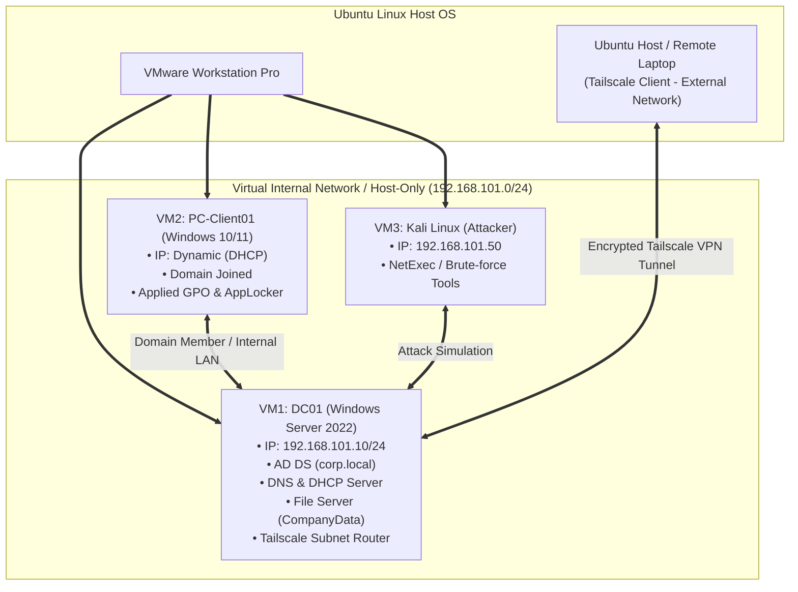

# Windows Server & Active Directory Enterprise Infrastructure Lab

[](https://ubuntu.com/)
[](https://www.vmware.com/)
[](https://www.microsoft.com/evalcenter/evaluate-windows-server-2022)
[
[](https://tailscale.com/)
[](https://www.kali.org/)
[](https://github.com/)

---

## 1. Giới thiệu dự án (Project Overview)

Dự án **Windows Server & Active Directory Enterprise Infrastructure Lab** mô phỏng mô hình hạ tầng mạng và quản trị hệ thống hoàn chỉnh cho một doanh nghiệp quy mô vừa và nhỏ trên nền tảng **Windows Server 2022**, được dựng dưới dạng máy ảo (Virtual Machines) trên hệ điều hành máy chủ **Ubuntu Linux** sử dụng phần mềm ảo hóa **VMware Workstation / VirtualBox**.

Dự án tập trung giải quyết các bài toán lõi trong quản trị hệ thống CNTT (System Administration & IT Infrastructure):
- **Định danh & Quản lý truy cập (IAM)**: Dựng Domain Controller, quy hoạch cấu trúc OU theo phòng ban (`CORP > IT, HR, Sales, Computers`), quản lý vòng đời User/Group theo mô hình RBAC.
- **Tăng cường bảo mật (System Hardening)**: Thiết lập Group Policy Objects (GPO) — chặn CMD, khóa USB storage, hạn chế Control Panel, kiểm soát thi hành phần mềm qua AppLocker.
- **Dịch vụ mạng lõi (Core Network Services)**: Cấu hình DNS phân giải hai chiều, cấp phát IP tự động qua DHCP Server, hạ tầng lưu trữ File Server phân quyền NTFS theo mô hình AGDLP.
- **Truy cập từ xa an toàn (Secure Remote Access)**: Triển khai giải pháp Mesh VPN (Tailscale Subnet Router) cho phép kết nối an toàn từ máy chủ Ubuntu (Host) vào tài nguyên nội bộ mà không cần mở port.
- **Sao lưu & Phục hồi (Backup & Recovery)**: Cấu hình Windows Server Backup — System State & Bare Metal Recovery, lập lịch tự động.
- **Mô phỏng Tấn công & Phòng thủ (Security Lab)**: Kết hợp Red Team (Kali Linux + NetExec Brute-force) và Blue Team (Event Log Analysis + Account Lockout Policy).

> **Checklist làm lab**: Xem ngay [PROJECT_CHECKLIST.md](file:///home/khai/Documents/WINDOWS-SERVER-ACTIVE-DIRECTORY-LAB/PROJECT_CHECKLIST.md) để thực hiện từng bước dự án.

---

## 2. Tóm tắt kỹ năng nổi bật (CV Highlights)

Dưới đây là các năng lực cốt lõi được chứng minh qua dự án (tương ứng với mô tả trên CV):

- **Triển khai Active Directory Domain Services (AD DS)**: Khởi tạo Forest/Domain `corp.local`, quy hoạch cấu trúc Organizational Unit (OU) theo phòng ban (`CORP > IT, HR, Sales, Computers`), quản lý Security Groups và tự động hóa tạo người dùng bằng PowerShell script.
- **Thực thi chính sách an toàn thông tin qua GPO**: Áp dụng GPO Baseline và Security Policy — ngăn chặn truy cập Command Prompt (`cmd.exe`), vô hiệu hóa thiết bị lưu trữ USB di động, hạn chế Control Panel, kiểm soát ứng dụng với AppLocker.
- **Quản trị dịch vụ hạ tầng mạng & Hạ tầng dữ liệu**: Cấu hình DNS Server (Forward/Reverse Lookup Zones), DHCP Server (Scope Options, Lease Range, Authorize AD), File Server phân quyền truy cập theo mô hình AGDLP (Share Permissions & NTFS Permissions).
- **Triển khai VPN & Sao lưu hệ thống**: Cấu hình Tailscale Subnet Router kết nối mạng nội bộ `192.168.101.0/24` từ xa an toàn; cấu hình Windows Server Backup (System State + Bare Metal Recovery) lập lịch tự động.
- **Mô phỏng tấn công & phòng thủ (Security Lab)**: Thực hiện Brute-force / Password Spraying qua NetExec trên Kali Linux; phân tích Event ID 4625/4740 trên Event Viewer; cấu hình Account Lockout Policy phòng chống tấn công.

---

## 3. Môi trường Virtualization & Kế hoạch địa chỉ IP

### 3.1 Mô hình Ảo hóa trên Ubuntu Linux (Hypervisor Topology)



### 3.2 Kế hoạch địa chỉ IP (IP Addressing Plan)

| Thiết bị | Môi trường / OS | Vai trò / Dịch vụ | Địa chỉ IP | Subnet Mask | DNS / Default Gateway |
| :--- | :--- | :--- | :--- | :--- | :--- |
| **DC01** | VM 1 (Windows Server 2022) | Domain Controller, DNS, DHCP, File Server, Tailscale Subnet Router | `192.168.101.10` (Static) | `255.255.255.0` | DNS: `127.0.0.1`<br/>GW: `192.168.101.1` |
| **PC-Client01** | VM 2 (Windows 10/11) | Client Workstation (Domain Joined) | Dynamic (`192.168.101.100` – `192.168.101.200`) | `255.255.255.0` | Cấp tự động qua DHCP (trỏ về `192.168.101.10`) |
| **Kali Linux** | VM 3 (Kali Linux) | Attacker / Penetration Testing | `192.168.101.50` (Static) | `255.255.255.0` | GW: `192.168.101.1` |
| **Ubuntu Host** | Physical Machine (Ubuntu Linux) | Hypervisor Host / External Remote Client | Dynamic / Public IP | Theo Host | Connect via Tailscale VPN Client |

- **Domain Name**: `corp.local`
- **Internal Subnet**: `192.168.101.0/24`
- **Virtual Network Mode**: Host-Only / Internal Network (cho giao tiếp giữa các máy ảo).

---

## 4. Chi tiết các giai đoạn triển khai (Implementation Phases)

### Giai đoạn 1: Dựng máy ảo & Triển khai Domain Controller (DC)
- Dựng máy ảo Windows Server 2022 trên VMware/VirtualBox (Ubuntu Host).
- Đặt IP tĩnh `192.168.101.10/24` và đổi tên máy chủ thành `DC01`.
- Cài đặt vai trò **Active Directory Domain Services (AD DS)** và DNS Server.
- Nâng cấp (Promote) server thành Domain Controller đầu tiên cho Forest `corp.local`.
- Phân tích: Sử dụng đuôi `.local` trong môi trường lab hoặc nội bộ giúp tách biệt hoàn toàn với không gian tên miền Public trên Internet (như `.com`, `.vn`), tránh xung đột phân giải DNS.

### Giai đoạn 2: Quản lý User và Cấu trúc Organizational Unit (OU)
- Mở **Active Directory Users and Computers (`dsa.msc`)**, thiết kế cây OU phân cấp: `CORP` (OU gốc) → Sub-OUs: `IT`, `HR`, `Sales`, `Computers`.
- Tạo các nhóm an toàn (Global Security Groups): `G_IT`, `G_HR`, và các Group tương ứng.
- Tạo User mẫu (VD: `nv.nguyenvan`, `it.tranvan`) và gán vào Security Group tương ứng.
- Áp dụng nguyên tắc **RBAC (Role-Based Access Control)**: Khi nhân viên mới vào, IT chỉ cần thêm User vào Group, tự động có đầy đủ quyền của phòng ban.
- *(Tự động hóa)* Sử dụng script PowerShell (`New-ADUser` kết hợp `Import-Csv`) từ `scripts/Create-ADUsers-Bulk.ps1`.

### Giai đoạn 3 & 4: Tăng cường bảo mật hệ thống qua Group Policy (GPO & AppLocker)
- **GPO Baseline**: Áp dụng quy định độ phức tạp mật khẩu (Password Policy) và Account Lockout Policy.
- **Chặn Command Prompt (CMD)**: User Configuration > Policies > Administrative Templates > System > `Prevent access to the command prompt` ➔ **Enabled**. Phòng ngừa thực thi script độc hại (batch file).
- **Hạn chế USB**: Computer Configuration > Policies > Administrative Templates > System > Removable Storage Access > `All Removable Storage classes: Deny all access` ➔ **Enabled**. Ngăn chặn Data Leakage và lây nhiễm virus từ USB.
- **Hạn chế Control Panel**: Ngăn người dùng tự ý thay đổi cấu hình mạng, tắt tường lửa hoặc gỡ bỏ phần mềm diệt virus.
- **AppLocker**: Cấu hình Executable Rules và bật dịch vụ `Application Identity (AppIDSvc)` tự động trên Client.

### Giai đoạn 5 & 6: Dịch vụ mạng lõi DNS & DHCP
- **DNS Server**: Xác nhận Forward Zone (`corp.local`) và tạo mới Reverse Lookup Zone `101.168.192.in-addr.arpa`. Kiểm tra `nslookup` 2 chiều.
- **DHCP Server**: Authorize DHCP trên AD, tạo Scope `192.168.101.100 - 192.168.101.200`, cài đặt Scope Options 003 (Gateway: `192.168.101.1`) & 006 (DNS: `192.168.101.10`). **Lưu ý**: Option 006 DNS **bắt buộc** phải trỏ về IP của DC, nếu sai Client sẽ không thể Join Domain.

### Giai đoạn 7: File Server Phân quyền theo mô hình AGDLP
- Hệ thống cấp phát không gian lưu trữ chung trên mạng (Share Folder): `CompanyData`.
- Phân quyền tuân thủ mô hình **AGDLP** của Microsoft: Account → Global Group → Domain Local Group → Permission.
- Thư mục `\CompanyData\Public`: Tất cả mọi người (Domain Users) có quyền Read/Write.
- Thư mục `\CompanyData\HR_Only`: Chỉ nhóm `G_HR` có quyền Modify, các nhóm khác bị từ chối (Deny).

### Giai đoạn 8: Triển khai Tailscale Subnet Router (Zero-Trust Remote VPN)
- Cài đặt Tailscale trên `DC01` và kích hoạt Subnet Router `192.168.101.0/24`.
- Tailscale là giải pháp Mesh VPN dựa trên nền tảng WireGuard, tạo đường hầm mã hóa (Encrypted Tunnel), cấp cho mỗi máy một IP ảo (VD: `100.x.y.z`).
- Ưu điểm: Không cần cấu hình Port Forwarding, vượt qua NAT/CGNAT, End-to-End Encryption.
- Kết nối từ máy chủ **Ubuntu Host** (ngoài mạng LAN ảo) qua Tailscale VPN, thử nghiệm RDP / SMB an toàn.

### Giai đoạn 9: Backup & Recovery (Sao lưu & Phục hồi)
- Cài đặt dịch vụ **Windows Server Backup (WSB)** qua Server Manager.
- Cấu hình backup **System State** và **Bare Metal Recovery**:
  - System State chứa toàn bộ cơ sở dữ liệu AD (file `NTDS.DIT`), cấu hình registry và SYSVOL.
- Lập lịch (Backup Schedule) chạy tự động vào lúc **02:00 AM** mỗi ngày, lưu trữ ra ổ cứng ảo riêng biệt (Disk 2).
- Ý nghĩa: Giảm RTO (Recovery Time Objective), phòng chống Ransomware — khôi phục từ System State Backup cứu sống toàn bộ hệ thống định danh.

### Giai đoạn 10: Mô phỏng Tấn công & Phòng thủ (Security Lab)
- **Red Team**: Sử dụng Kali Linux (`192.168.101.50`) với công cụ `nxc` (NetExec) tấn công Brute-force / Password Spraying qua giao thức SMB:
  ```
  nxc smb 192.168.101.10 -u users.txt -p passwords.txt
  ```
- **Blue Team**: Phân tích Event Viewer > Windows Logs > Security:
  - **Event ID 4625** (Audit Failure): Đăng nhập thất bại, chỉ rõ IP nguồn kẻ tấn công.
  - **Event ID 4740** (Account Locked Out): Tài khoản bị hệ thống khóa.
- **Phòng thủ (Account Lockout Policy)**: Cấu hình qua Default Domain Policy:
  - Account lockout threshold: **5 invalid logon attempts**
  - Account lockout duration: **30 minutes**
  - Kết quả: Sau 5 lần đoán sai, tài khoản bị khóa cứng, vô hiệu hóa hoàn toàn Brute-force.

---

## 5. Đánh giá hệ thống (System Evaluation)

### 5.1 Ưu điểm của mô hình Lab
- **Tiết kiệm chi phí**: Không tốn chi phí mua sắm thiết bị phần cứng (Server vật lý, Switch, Router).
- **Môi trường an toàn (Sandboxed)**: Cho phép tự do thử nghiệm các kỹ thuật cấu hình khó hoặc chạy malware/tools tấn công mà không ảnh hưởng đến hệ thống mạng nhà hoặc trường học.
- **Bao quát kiến thức**: Chạm đến được tất cả các lõi quan trọng của hệ thống hạ tầng IT doanh nghiệp (Identity, Network Services, Security).

### 5.2 Hạn chế
- **Single Point of Failure (SPOF)**: Chỉ có một Domain Controller. Nếu máy chủ này sập, toàn bộ hệ thống phân giải tên miền và đăng nhập sẽ tê liệt.
- **Hiệu năng**: Phụ thuộc hoàn toàn vào phần cứng của máy tính Host chạy ảo hóa.
- **Thiếu thực tế về Network**: Chưa có thiết bị tường lửa vật lý (FortiGate, pfSense) và chia VLAN phức tạp như doanh nghiệp thật.

### 5.3 So sánh với môi trường doanh nghiệp thực tế
- Doanh nghiệp thực tế luôn có ít nhất **2 Domain Controller** (Primary và Additional DC) để đảm bảo High Availability và cân bằng tải.
- Xu hướng dịch chuyển lên Cloud: Mô hình **Hybrid Identity** (kết nối AD On-premise đồng bộ lên Microsoft Entra ID / Azure AD) để nhân viên sử dụng 1 tài khoản cho cả máy tính nội bộ và Office 365.

---

## 6. Nhật ký xử lý sự cố (Troubleshooting Log)

| STT | Sự cố gặp phải (Issue) | Nguyên nhân (Root Cause) | Lệnh chẩn đoán & Cách xử lý (Resolution) |
| :---: | :--- | :--- | :--- |
| **1** | Lỗi *"The server is not operational"* khi Client join domain | Client chưa trỏ địa chỉ **Preferred DNS** về IP của Domain Controller (`192.168.101.10`). | Cấu hình card mạng Client, trỏ Preferred DNS về `192.168.101.10`. Thử lại lệnh join domain. |
| **2** | Ping tên miền `corp.local` thất bại dù ping IP tĩnh thành công | Cache DNS cũ trên máy client hoặc DNS Suffix chưa đúng cấu hình. | Chạy lệnh `ipconfig /flushdns` và `ipconfig /registerdns`. Kiểm tra DNS Suffix trong Advanced TCP/IP. |
| **3** | Lỗi xác thực **Kerberos** khi đăng nhập tài khoản Domain trên Client | Thời gian đồng hồ (System Time) giữa Client và DC bị lệch quá ngưỡng 5 phút cho phép. | Đồng bộ lại thời gian giữa Client và DC bằng lệnh `w32tm /resync`. Đảm bảo cùng Time Zone. |
| **4** | Lỗi không tìm thấy Domain Controller (`nltest` báo lỗi) | Dịch vụ DNS hoặc Netlogon trên DC chưa sẵn sàng hoặc bị nạp chậm. | Chạy `dcdiag /test:dns` trên DC và `nltest /dsgetdc:corp.local` trên máy Client để xác minh locator. |

---

## 7. Kết luận & Định hướng phát triển

### 7.1 Những gì đã học được
Thông qua quá trình tự tay cài đặt và vận hành mô hình này, các khái niệm lý thuyết trừu tượng như DNS, DHCP, GPO hay các Event ID đã trở thành những thao tác kỹ thuật thực tế. Việc đóng vai cả "Kẻ tấn công" và "Người phòng thủ" giúp hình thành tư duy bảo mật hệ thống toàn diện (**Security by Design**) ngay từ khâu thiết kế cơ sở hạ tầng.

### 7.2 Định hướng phát triển thêm (Future Work)
- **Triển khai Additional Domain Controller**: Cấu hình Replication (Đồng bộ) giữa 2 DC để xây dựng hệ thống chịu lỗi.
- **Tích hợp hệ thống SIEM**: Cài đặt Wazuh hoặc Splunk để thu thập log Event Viewer, cấu hình cảnh báo qua Telegram/Email khi có Event ID 4625 (tấn công Brute-force).
- **Triển khai Enterprise CA (AD CS)**: Cấp phát chứng chỉ số SSL/TLS nội bộ cho hệ thống mạng.

---

## 8. Cấu trúc Repository (Repository Layout)

```text
WINDOWS-SERVER-ACTIVE-DIRECTORY-LAB/
├── README.md                           # Tài liệu tổng quan dự án (Project Documentation)
├── PROJECT_CHECKLIST.md                # Checklist các bước thực hiện chi tiết từ A-Z
├── docs/                               # Hướng dẫn chi tiết từng giai đoạn
│   ├── 01-domain-controller.md         # Giai đoạn 1: Dựng AD DS & Forest
│   ├── 02-user-ou-structure.md         # Giai đoạn 2: Cấu trúc OU & User
│   ├── 03-gpo-baseline.md              # Giai đoạn 3: Baseline GPO
│   ├── 04-gpo-security-hardening.md    # Giai đoạn 4: Chặn CMD, USB, Control Panel, AppLocker
│   ├── 05-dns-configuration.md         # Giai đoạn 5: Forward/Reverse DNS
│   ├── 06-dhcp-scope.md                # Giai đoạn 6: Cấu hình DHCP Scope
│   ├── 07-file-server-permissions.md   # Giai đoạn 7: Phân quyền File Server (AGDLP)
│   ├── 08-troubleshooting-guide.md     # Giai đoạn 8: Chi tiết các lỗi & xử lý
│   ├── 09-vpn-tailscale.md             # Giai đoạn 9: Triển khai Tailscale VPN
│   ├── 10-backup-recovery.md           # Giai đoạn 10: Backup & Recovery
│   ├── 11-security-lab.md              # Giai đoạn 11: Mô phỏng Tấn công & Phòng thủ
│   └── 12-evaluation-conclusion.md     # Giai đoạn 12: Đánh giá & Kết luận
├── scripts/                            # Thư mục chứa các kịch bản tự động hóa
│   ├── Create-ADUsers-Bulk.ps1         # Script PowerShell khởi tạo User từ CSV
│   └── users_data.csv                  # File dữ liệu đầu vào người dùng mẫu
└── screenshots/                        # Hình ảnh minh chứng kết quả lab
    ├── 01-ad-ds-installed.png
    ├── 02-ou-structure.png
    ├── 04-gpo-cmd-blocked.png
    ├── 06-dhcp-client-ip.png
    ├── 07-file-permissions.png
    └── 09-tailscale-vpn-connected.png
```

---

## 9. Checklist kết quả đạt được (Verification Checklist)

- [x] **Môi trường Ảo hóa**: Tạo 3 máy ảo (Windows Server 2022, Windows 10/11, Kali Linux) trên Ubuntu Host bằng VMware/VirtualBox.
- [x] **Domain Controller**: Nâng cấp DC01 thành công, tạo Forest `corp.local`, đăng nhập tài khoản Domain Administrator.
- [x] **OU & Group Structure**: Thiết lập cấu trúc OU `CORP > IT, HR, Sales, Computers`; phân quyền nhóm Security Group theo mô hình RBAC.
- [x] **GPO Baseline & Enforcement**: Áp dụng GPO thành công — Command Prompt bị chặn, USB bị Deny Access, Control Panel bị hạn chế.
- [x] **AppLocker**: Kiểm soát các ứng dụng không hợp lệ qua AppLocker & service `AppIDSvc`.
- [x] **DNS Services**: Phân giải tên miền 2 chiều (Forward/Reverse Lookup) hoàn tất không có lỗi.
- [x] **DHCP Services**: Client nhận IP tự động, Gateway và DNS chuẩn xác từ DHCP Scope Options.
- [x] **File Server**: Cấu hình phân quyền theo mô hình AGDLP (`CompanyData` — `Public` / `HR_Only`).
- [x] **Tailscale VPN**: Kết nối từ xa thành công từ Ubuntu Host qua Subnet Router.
- [x] **Backup & Recovery**: Cấu hình Windows Server Backup — System State + Bare Metal Recovery, lập lịch 02:00 AM.
- [x] **Security Lab**: Thực hiện tấn công Brute-force với NetExec, phân tích Event ID 4625/4740, cấu hình Account Lockout Policy phòng thủ thành công.
- [x] **Troubleshooting**: Tổng hợp và xử lý thành công 4 nhóm sự cố hạ tầng thường gặp.

---

## 10. Tài liệu tham khảo (References)

- Microsoft Learn (n.d.). *Active Directory Domain Services Overview*. Truy xuất từ: [https://learn.microsoft.com/en-us/windows-server/identity/ad-ds/get-started/virtual-dc/active-directory-domain-services-overview](https://learn.microsoft.com/en-us/windows-server/identity/ad-ds/get-started/virtual-dc/active-directory-domain-services-overview)
- Microsoft Docs (n.d.). *Group Policy Objects*. Truy xuất từ tài liệu cấu hình bảo mật hệ thống Windows.
- Offensive Security (n.d.). *Kali Linux Documentation*.
- Porchetta Industries (n.d.). *NetExec Wiki*. Truy xuất từ: [https://www.netexec.wiki/](https://www.netexec.wiki/)
- Tailscale (n.d.). *What is Tailscale?*. Truy xuất từ: [https://tailscale.com/kb/1151/what-is-tailscale](https://tailscale.com/kb/1151/what-is-tailscale)

---

## 11. Tác giả & Liên hệ (Author)

- **Họ và tên**: Hoàng Trần Việt Khải
- **Vị trí định hướng**: System Administrator / IT Infrastructure Engineer / Network & Security Specialist
- **OS Máy chủ Lab**: Ubuntu Linux
- **Email**: *hoangtranvietkhai@gmail.com*
- **GitHub**: [github.com/HoangTranVietKhai11](https://github.com/HoangTranVietKhai11)
